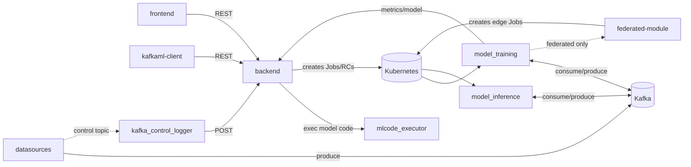

# Modules

This section is an internals deep-dive: how each service is actually
built, not how to use it. For the user-facing "how do I train/deploy a
model" walkthroughs, see [Usage](../usage/single-models); for the
high-level component map, see [Architecture](../architecture).

Each page traces its claims back to that module's own `CLAUDE.md`
(the AI-assistant instructions committed alongside the code — the most
up-to-date internal documentation available) and the real source, with
file paths and function/class names so you can jump straight to the
code.

| Module | What it is |
|---|---|
| [backend](./backend) | The REST API and Kubernetes orchestrator at the center of Kafka-ML — stores every model/configuration/deployment/result, and creates the real `Job`/`Deployment`/`ReplicationController` objects. |
| [frontend](./frontend) | The React 19 + shadcn/ui web UI everything above is driven through. |
| [federated-module](./federated-module) | The satellite service that matches registered datasources against registered models and launches federated edge-worker training Jobs. |
| [model_training](./model-training) | The training containers (TensorFlow + PyTorch) — where the 9 CASE dispatch modes (single/distributed/federated × classic/incremental, plus blockchain) actually live. |
| [model_inference](./model-inference) | The ReplicationControllers that consume a live input Kafka topic and produce predictions to an output topic. |
| [mlcode_executor](./mlcode-executor) | The `tfexecutor`/`pthexecutor` services that sandbox-`exec()` submitted model code before it's ever allowed to run as a real training/inference Job. |
| [datasources](./datasources) | The client-side `kafkaml-datasources` package for sending training/inference data into Kafka in the shape Kafka-ML expects. |
| [kafkaml-client](./kafkaml-client) | The Python SDK's internals — for the public API itself, see the [SDK docs](/sdk/intro). |
| [kafka_control_logger](./kafka-control-logger) | The small relay that forwards Kafka control-topic messages (new datasource registrations) into `backend` over HTTP. |
| [tf-kafka-dataset](./tf-kafka-dataset) | The `tensorflow-io` replacement package `model_training/tensorflow` and `federated-module` both read Kafka data through. |
| [kustomize](./kustomize) | The Kubernetes manifests/overlays that deploy everything above. |

## How the pieces connect

`backend` is the only service every other piece talks to over HTTP;
everything else that moves data does so through Kafka topics, not direct
service-to-service calls. See each module's own page for the specific
topics/manifests involved.
